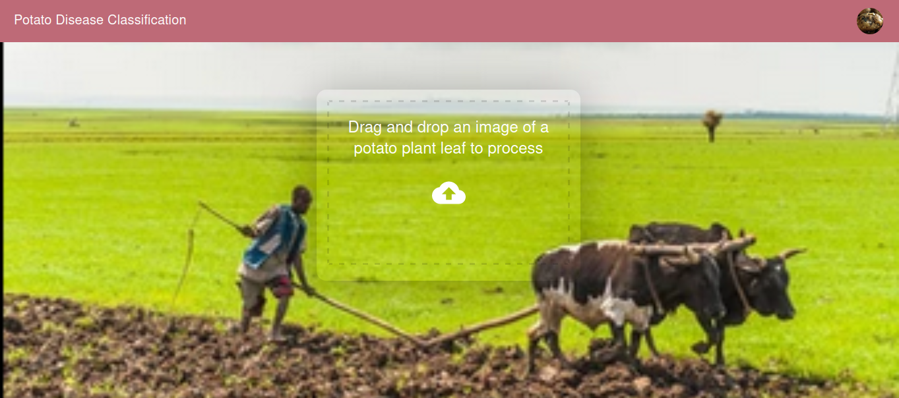

# Potato Disease Classification project

> In this project I trained a CNN model and predicted three types of potato leaf. Either the potato may be healthy or has an early blight disease or late blight disase. The model has good accuracy on these 3 classes. But it is accepting only images of size (256,256) if we pass images other than that shape it won't work. As a future work I have planned to insert resizing function. I used FastApi as a back end implementation to call the model and predict the disease.

 

## Built With

- Python, HTML, CSS, JavaScript, jQuery
- FastApi

## Getting Started

> git clone `https://github.com/Micky373/potato_disease_classification_using_deep_learning.git`

> cd potato_disease_classification_using_deep_learning

> pip install -r requirements.txt

> cd api

> python main.py

> Then cd .. to go to the frontend foler

> Here run `npm install --from-lock-json` and when it finshes `npm audit fix`

> After the installation completed run `npm run start`

> Then drag and drop any images of potato leaf which is a size of (256,256)

> Then the result will be shown shortly

> The EDA and model training is contained in the notebooks folder the notebook is `EDA_model_training_and_saving.ipynb`

## Author

- GitHub: [@GitHub](https://github.com/Micky373)

- LinkedIn: [LinkedIn](https://www.linkedin.com/in/michaeltamirie/)

## 🤝 Contributing

Contributions, issues, and feature requests are welcome!

Feel free to check the [issues page](https://github.com/Micky373/potato_disease_classification_using_deep_learning/issues).

## Show your support

Give a ⭐️ if you like this project!

## Acknowledgments

- Special thanks to [Dhaval Patel](https://www.linkedin.com/in/dhavalsays/)
- The UI implementation and code flow done with the help of [this play list](https://youtube.com/playlist?list=PLeo1K3hjS3ut2o1ay5Dqh-r1kq6ZU8W0M)

## 📝 License

This project is [MIT](./MIT.md) licensed.
